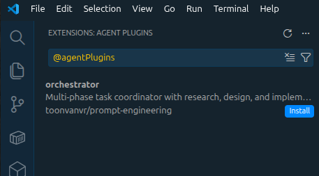

# Prompt Engineering

AI agent system for VS Code GitHub Copilot (primary) and Claude Code. Specialized sub-agents handle research, design, and implementation with quality-gated handoffs.

## Setup

See [docs/setup.md](docs/setup.md) for installation details, troubleshooting, and local development setup.

Add these to VS Code User Settings:

```jsonc
{
	"chat.plugins.enabled": true,
	"chat.plugins.marketplaces": ["toonvanvr/prompt-engineering"] // add this marketplace
}
```

`chat.plugins.enabled` turns plugin support on.

`chat.plugins.marketplaces` registers this repository as a plugin marketplace.



Pick **Orchestrator (toonvanvr)** from the agent dropdown in Copilot Chat

## Agents

| Agent | Visibility | Role |
|-------|-----------|------|
| **Orchestrator (toonvanvr)** | User-facing | Task decomposition, delegation, never implements |
| Researcher (toonvanvr) | Subagent | Codebase analysis, web research, dependency mapping |
| Designer (toonvanvr) | Subagent | Architecture specs, trade-off analysis |
| Implementer (toonvanvr) | Subagent | Code execution per design contract |
| Compiler (toonvanvr) | Subagent | Prompt compression (50-70% token reduction) |
| **Copilot Setup (toonvanvr)** | User-facing | VS Code settings configuration |

Sub-agents communicate via files, run in isolated contexts, and pass through quality gates. You never interact with them directly.

## Usage

Talk to the Orchestrator the way you'd describe a task to a colleague — natural language, as specific or vague as you want:

> the validate task should also use ignition-validate on all compiled files

> Convert all sh scripts like bootstrap into JS, unless they're meant to run client-side and would add a dependency. Have a validation to check asynchronously which hosts have which services working or not.

The orchestrator will interpret your request, research the codebase, design a solution if needed, and implement it — all through specialized sub-agents. See the [prompting guide](plugins/orchestrator/docs/examples/) for more examples and tips.

## Development

### Plugin Structure
```
plugins/orchestrator/
├── agents/         # Compiled .agent.md files (generated, DO NOT EDIT)
├── skills/         # Agent Skills (committed)
├── src/            # Source files (EDIT THESE)
│   ├── *.src.md    # Agent source definitions
│   ├── shared/     # Composable fragments (@include targets)
│   ├── reference/  # Detail tables for compilation
│   └── kernel/     # Compile-time reference
└── docs/examples/  # Example prompts
```

### Compilation
```
src/*.src.md → src/precompiled/*.pre.md → agents/*.agent.md
```

Edit sources in `src/`, invoke **Compiler (toonvanvr)** to recompile.

## License

[MPL-2.0](LICENSE)

