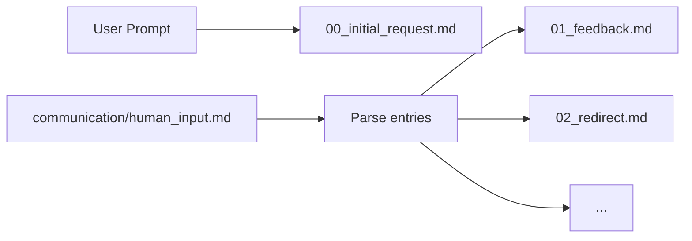

# Prompt Preservation

Every prompt must be preserved for audit trail and context recovery.

---

## Core Principle

> First action of every session: copy prompt to `00_prompts/`.
> Human inputs get sequential numbers.
> Nothing is lost; everything is traceable.

---

## Startup Sequence

```
1. Create `.ai/scratch/{YYYY-MM-DD}_{topic}/`
2. Create `00_prompts/` subdirectory
3. Copy initial prompt to `00_prompts/00_initial_request.md`
4. Continue with normal execution
```

---

## File Format

```markdown
# {Title}

**Timestamp**: {ISO8601}
**Source**: initial | human_input | redirect

---

{Original text verbatim, no modifications}
```

---

## Naming Convention

|Source|Filename|
|-|-|
|Initial user prompt|`00_initial_request.md`|
|Human feedback|`01_feedback.md`|
|Human redirect|`02_redirect.md`|
|Additional context|`03_context.md`|
|Subsequent inputs|`{seq}_{action}.md`|

Sequence numbers are zero-padded: `01`, `02`, ..., `99`.

---

## Processing Flow



---

## Why Preserve?

1. **Audit trail**: Know exactly what was requested
2. **Context recovery**: Resume sessions with full context
3. **Learning**: Extract patterns from successful prompts
4. **Debugging**: Trace issues to original request

---

## Agent Integration

Add to ALWAYS list:
```md
- Copy initial prompt to `00_prompts/00_initial_request.md` as first action
- Move processed human inputs to `00_prompts/{seq}_{action}.md`
```

Add to startup protocol:
```md
2. Create workfolder: `.ai/scratch/{YYYY-MM-DD}_{topic}/`
   a. Create `00_prompts/` subdirectory
   b. Write `00_initial_request.md` with user prompt
```

---

## Enforcement

This is a **mandatory** rule. Sessions without `00_prompts/00_initial_request.md` are non-compliant.

Gate check: Before proceeding to Analysis phase, verify `00_prompts/00_initial_request.md` exists.
